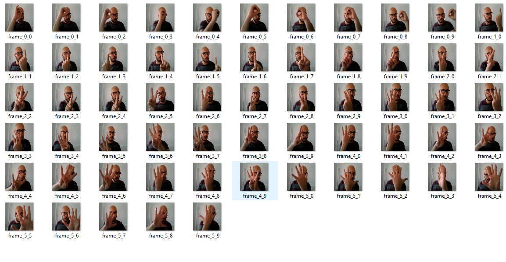

# How Can we Create our Own Datasets

In this tutorial I will go through the creation of an image dataset. The purpose of this tutorial is to give you an idea on how it is easy to create your own dataset and to publish it on the internet so others can use it.

## Define goals

People create data sets to serve a specific purpose, so they can solve a real world problem or facilitate some difficult tasks through artificial intelligence. In other words, train models to perform a human being task.
To train a model we have to feed it with data. it is not always the case, but in general, the more data we have! the best performance we get!
The purpose of this dataset is to solve a real world problem, which recognizing sign language using our own dataset. We will talk about the model next time. Here we focus on the creation of the Data set

## Chose materiels

### Hardware

There's many different ways to create an image dataset out there. In this tutorial, we will make use of our personal computers.

### Sotware

I will be using:

- `python3` as programming language

- `opencv` the open computer vision library  so we can play around our cams

## Installation

### Download github repo

```shell
git clone https://github.com/deepKratos/eikonon.git
```

### Create virtual environement

- Windows users

```shell
python -m venv myenv # creates a virtual environement
cd myenv\Scripts # change folder
.\activate # activate environement
```

- Linux users

```shell
python -m venv myenv # creates a virtual environement 
cd myenv\bin # change folder
source activate # activate environement  
```

### Install dependencies

```shell
pip install opencv-python
pip install numpy
pip install matplotlib
```

## Run the code

To execute the code:

`python eikonon <number of seconds> <path to save images>`

- Examples 1 -- take a capture every "2 seconds" and save it to the "images" folder in the same directory:

```shell
python eikonon 2 images
```

- Example 2 -- take a capture every "5 seconds" and save it to the "test" folder in the same directory: 

```shell
python eikonon 5 test
```



## Debug code

- utils.py : contains helper functions

  - show_window(...) -- configure opencv window

  - initialize_parameters(...) -- initilize camera object

  - write_to_folder(...) -- write images to the chosen path folder

- eikonon.py : main script code

## Data Augmentation

## Author

- **Hichem MAIZA**

## Acknoldgement

- **Pr. Emmanuel Morin** for his great advice: Hichem, If you need data, creat it !

- **Intel for OpenCV**